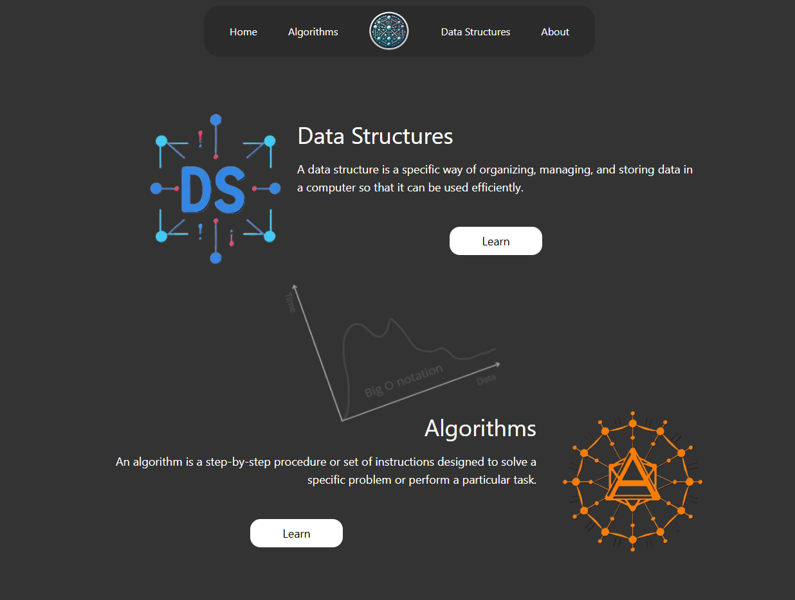
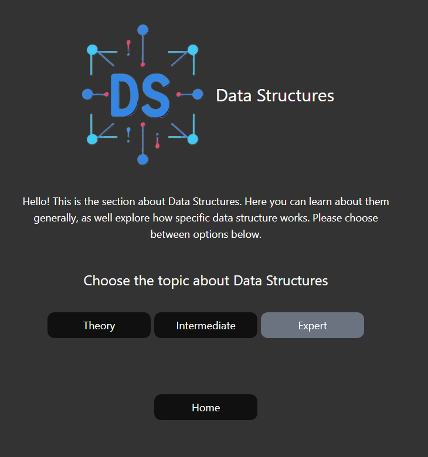
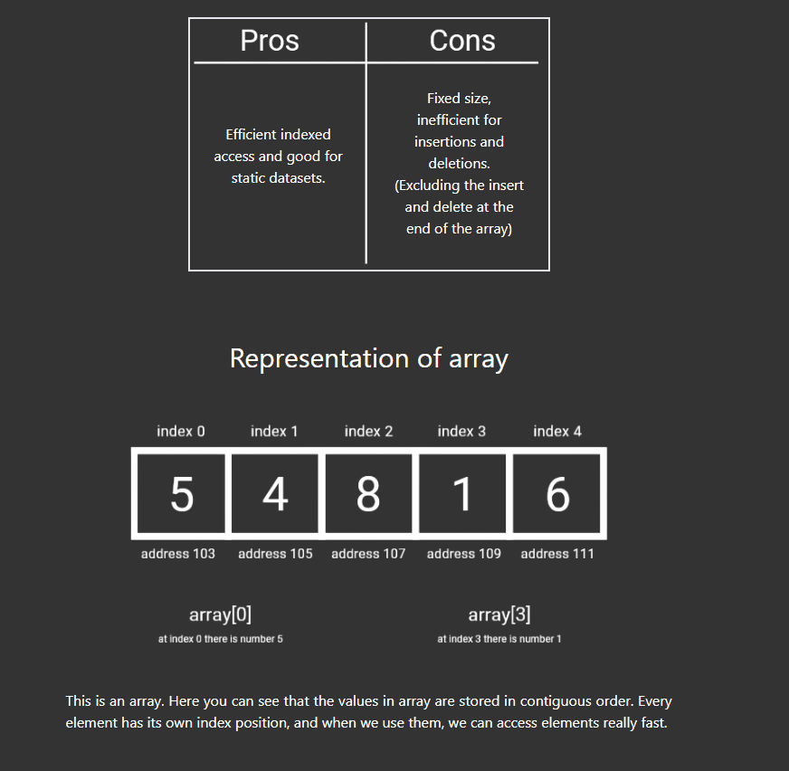
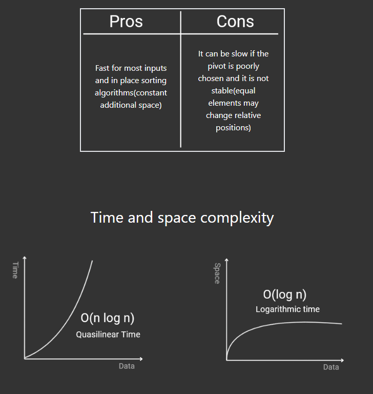
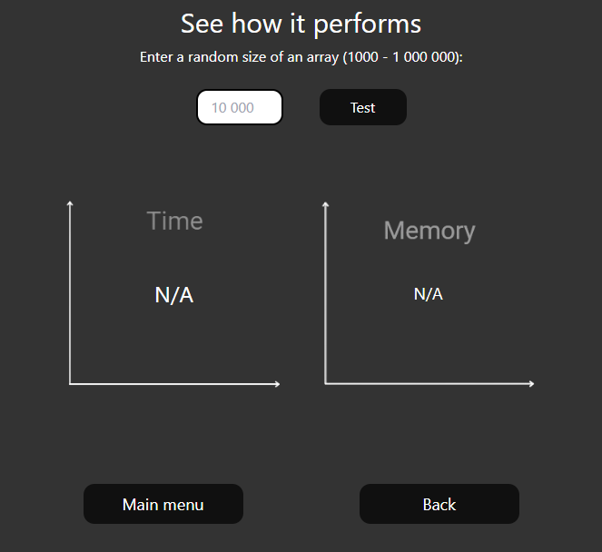

# Algorithms Data Structure

## Project Overview

The Algorithms and Data Structures project is an educational platform designed to help myself learn, visualize, and simulate various data structures and algorithms. The project features a React frontend using Tailwind CSS for styling and a Spring Boot backend that handles algorithm logic and data processing.

The goal of this project is to provide (in short) a theory behind algorithms and data structures, help me to understand it better, while learning the concepts of React, Tailwind and Java.

## Features

* Backend: A Spring Boot API serving various algorithms.
* Frontend: A React application styled with Tailwind CSS, with interactive features for algorithm performance demonstrations.
* Algorithms: A collection of algorithms implemented in Java and exposed via API for educational purposes.
* Data Structures: Includes visualizations and theory for various data structures like arrays, linked lists, graphs, and more.

## Installation

### Backend
1. Clone the repository
```
git clone https://github.com/husejn09/bus-schedule-backend.git
```
2. Navigate to the backend directory
```
cd algorithmsDataStructures/backend
```
3. Build the Spring Boot application
```
mvn clean package
```
4. Run the backend application:
```
java -jar target/algorithmsDataStructures.jar
```
5. Start the backend service
* The backend will be available at http://localhost:8080

### Frontend
1. Navigate to the frontend directory
```
cd frontend
```

2. Install the required dependencies
```
npm install
```

3. Start the development server
```
npm run dev
```

4. The frontend will be available at http://localhost:5173 (usually)

### Enviroment variables
Make sure to set the following environment variable for the frontend
* REACT_APP_BASE_URL to point to your backend API (e.g., http://localhost:8080/algorithms/)

## Screenshots
Here are some screenshots of the app parts
* Landing part


* Inside the Data Structure


* One part of specific DS (array)


* One part of specfic Algorithm, e.g. (Quick Sort)


* Performance part for sorting Algorithms


## License
This project is licensed under the MIT License - see the [LICENSE](./LICENSE) file for details.
